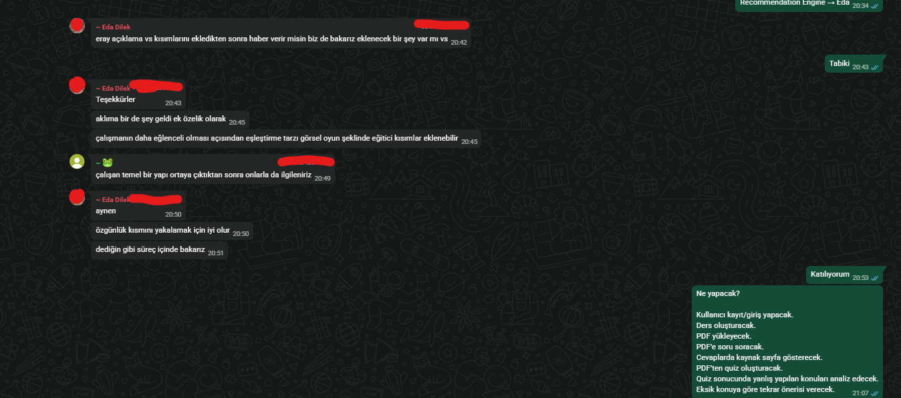
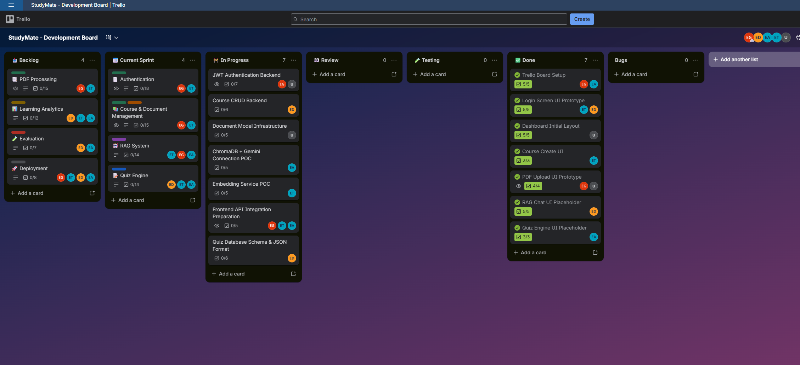
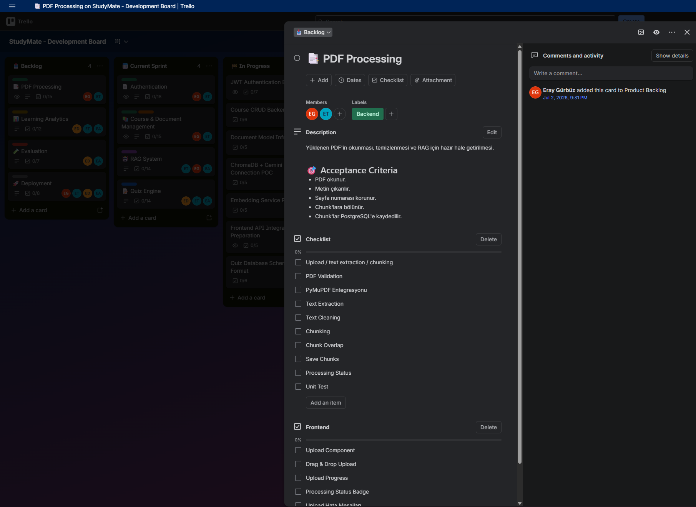
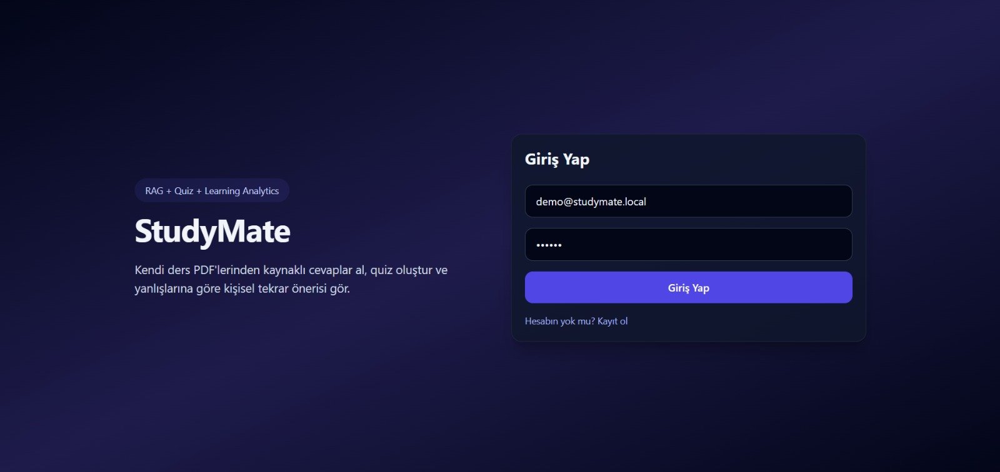
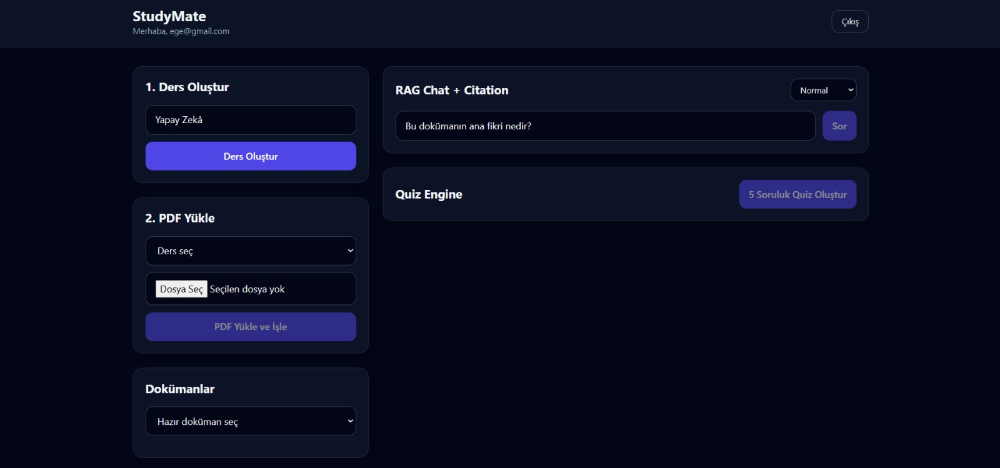

# StudyMate AI

## Takım İsmi

**Takım 113**

---

## Ürün İle İlgili Bilgiler

### Takım Elemanları

- **Eray Gürbüz:** Scrum Master
- **Esra Aydın :** Product Owner
- **Esra Meriç Topaktaş:** Developer
- **Eda Dilek:** Developer
- **Ege Onur Ünser:** Developer

---

## Ürün İsmi

**-- StudyMate AI --**

---

## Ürün Açıklaması

**StudyMate AI**, öğrencilerin kendi ders PDF'lerini yükleyerek bu dokümanlar üzerinden soru sorabildiği, kaynak sayfa referanslı cevaplar alabildiği ve yüklenen notlardan otomatik quiz oluşturabildiği yapay zekâ destekli bir öğrenme asistanıdır.

Projenin temel amacı, öğrencinin yalnızca belgeye soru sormasını sağlamak değil; aynı zamanda quiz sonuçlarına göre hangi konularda zorlandığını belirlemek ve kişiselleştirilmiş tekrar önerileri sunmaktır. Böylece StudyMate AI, klasik bir PDF chatbot'tan farklı olarak öğrencinin öğrenme sürecini takip eden ve eksik konularını görünür hale getiren bir çalışma arkadaşı olarak konumlanmaktadır.

---

## Ürün Özellikleri

Geliştirme süreci sonunda hedeflenen temel özellikler:

- Kullanıcı kayıt ve giriş sistemi
- Ders oluşturma ve ders bazlı doküman yönetimi
- PDF yükleme ve PDF içeriğini ayrıştırma
- PDF içeriğini chunk'lara bölme
- Gemini embedding ile belge içeriğini vektörleştirme
- ChromaDB ile semantik arama yapma
- Yüklenen PDF'e özel RAG tabanlı soru-cevap sistemi
- Cevaplarda kaynak sayfa gösterimi
- PDF içeriğinden otomatik quiz üretme
- Quiz çözme ve sonucu kaydetme
- Yanlış yapılan konulara göre zayıf konu analizi
- Eksik konulara göre tekrar önerisi oluşturma
- Basit RAG evaluation/test senaryoları

Sprint ilerledikçe bu liste tamamlanan özelliklere göre güncellenecektir.

---

## Hedef Kitle

- Lise öğrencileri
- Üniversite öğrencileri
- KPSS, ALES, YKS gibi sınavlara hazırlanan adaylar
- Kendi kendine çalışan bireyler
- Ders notlarını daha verimli kullanmak isteyen öğrenciler
- 15 - 30 yaş arası dijital öğrenme araçlarını kullanan kişiler

---

## Product Backlog URL

[StudyMate Trello Backlog Board](https://trello.com/invite/b/6a46ad8213bef21d683b442c/ATTI86989348b8784aece4373a6a16585f601D876828/-)

Backlog yapısı Trello üzerinde aşağıdaki ana Epic kartları üzerinden planlanmıştır:

- Authentication
- Course & Document Management
- PDF Processing
- RAG System
- Quiz Engine
- Learning Analytics
- Evaluation
- Deployment

Trello kolon yapısı:

- Product Backlog
- Sprint 1
- In Progress
- Review
- Testing
- Done
- Bugs

---

# SPRINT 1

Sprint içi puan değerlendirmesi **15** olarak belirlenmiştir.

**Puan tamamlama mantığı:** Proje boyunca tamamlanması gereken toplam backlog puanı **100** olarak belirlenmiştir. İlk sprint için bitirilmesi hedeflenen puan sayısı **15** olarak seçilmiştir. Sprint 1’de ürünün tamamen tamamlanması değil; projenin temel altyapısının kurulması, ilk arayüz ekranlarının hazırlanması ve sonraki sprintlerde geliştirilecek PDF işleme, RAG Chat, Quiz Engine ve Learning Analytics modülleri için başlangıç yapısının oluşturulması hedeflenmiştir.

**Daily Scrum:** Daily Scrum görüşmelerinin takım üyelerinin uygunluk durumuna göre **WhatsApp** üzerinden yapılmasına karar verilmiştir. Günlük ilerleme takibi Trello kartları üzerinden sağlanmış, ihtiyaç duyulan durumlarda kısa çevrim içi görüşmeler yapılmıştır.

**Toplantı ve Daily Scrum ScreenShotları:**

  
Daily Scrum WhatsApp ekran görüntüsünü görüntülemek için tıklayın

Tasarım ve Developing Mantığı: Tasarım ve geliştirme sürecinin birlikte ilerlemesine karar verilmiştir. Sprint 1’de tasarım tarafında ürünün final ekranlarından ziyade temel kullanıcı akışını gösterecek ilk prototip ekranlara odaklanılmıştır. Geliştirme tarafında ise backend, frontend, AI/RAG ve quiz modüllerinin ilerleyen sprintlerde bağımsız geliştirilebilmesi için temel yapı oluşturulmuştur.

Sprint 1 board update: Sprint Board Screenshot:

Sprint 1 başlangıcında Trello üzerinde ürün backlog’u oluşturulmuş, ana epic kartları belirlenmiş ve Sprint 1 kapsamında üzerinde çalışılacak görevler Current Sprint listesine alınmıştır.

Backlog ve Current Sprint görünümü:

Sprint 1 görev akışı ve durum listeleri:

**Ürün Durumu:** Ekran Görüntüleri:

Giriş ekranı:

Dashboard / PDF yükleme ekranı:

**Sprint Review:**

Sprint 1 sonunda StudyMate projesinin temel iskeleti oluşturulmuştur. Kullanıcı giriş ekranı, dashboard yapısı, ders oluşturma alanı, PDF yükleme bölümü, doküman seçme alanı, RAG Chat + Citation bölümü ve Quiz Engine başlangıç alanı hazırlanmıştır.

Bu sprintte ürünün tüm özelliklerinin tamamlanması hedeflenmemiştir. Öncelik; proje yapısının kurulması, takım görev dağılımının netleşmesi ve sonraki sprintlerde geliştirilecek PDF işleme, RAG, quiz ve analiz modülleri için başlangıç zemininin hazırlanması olmuştur.

Alınan kararlar:

- Ürün adının **StudyMate** olarak kullanılmasına karar verilmiştir.
- İlk aşamada PDF tabanlı kişisel öğrenme asistanı akışına odaklanılmasına karar verilmiştir.
- Sprint 2’de PDF upload, text extraction, chunking ve embedding akışının geliştirilmesine karar verilmiştir.
- RAG Chat ve Quiz Engine alanlarının arayüzde yer almasına, gerçek veriyle çalışan hâllerinin sonraki sprintlerde tamamlanmasına karar verilmiştir.
- Quiz sonrası yanlış konu analizi ve kişisel tekrar önerisi projenin ayırt edici özellikleri olarak belirlenmiştir.

Sprint Review katılımcıları:

- Eray Gürbüz
- Esra Aydın
- Esra Meriç Topaktaş
- Eda Dilek
- Ege Onur Ünser

**Sprint Retrospective:**

- Takım içindeki görev dağılımının backend, frontend, AI/RAG ve quiz/analytics başlıklarına göre ilerlemesine karar verilmiştir.
- Trello kartlarında checklist ve acceptance criteria maddelerinin daha düzenli takip edilmesi gerektiği belirlenmiştir.
- Frontend görevlerinin ilgili epic kartlarının içinde daha açık şekilde belirtilmesine karar verilmiştir.
- Sprint 2’de PDF Processing ve RAG altyapısına daha fazla teknik ağırlık verilmesi kararlaştırılmıştır.

---

# Notlar

Bu README, Sprint 1 başlangıç dokümanı olarak hazırlanmıştır. Proje ilerledikçe her sprint sonunda aşağıdaki bölümler güncellenecektir:

- Sprint board screenshotları
- Daily Scrum kayıtları
- Ürün ekran görüntüleri
- Sprint Review çıktıları
- Sprint Retrospective kararları
- Tamamlanan özellik listesi
