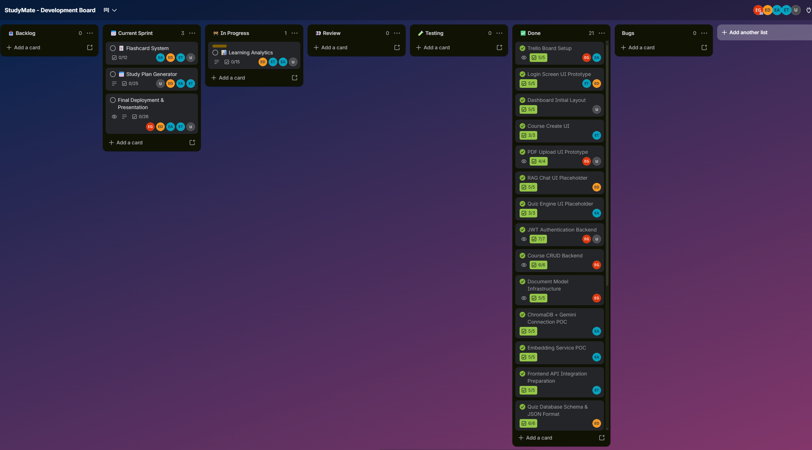
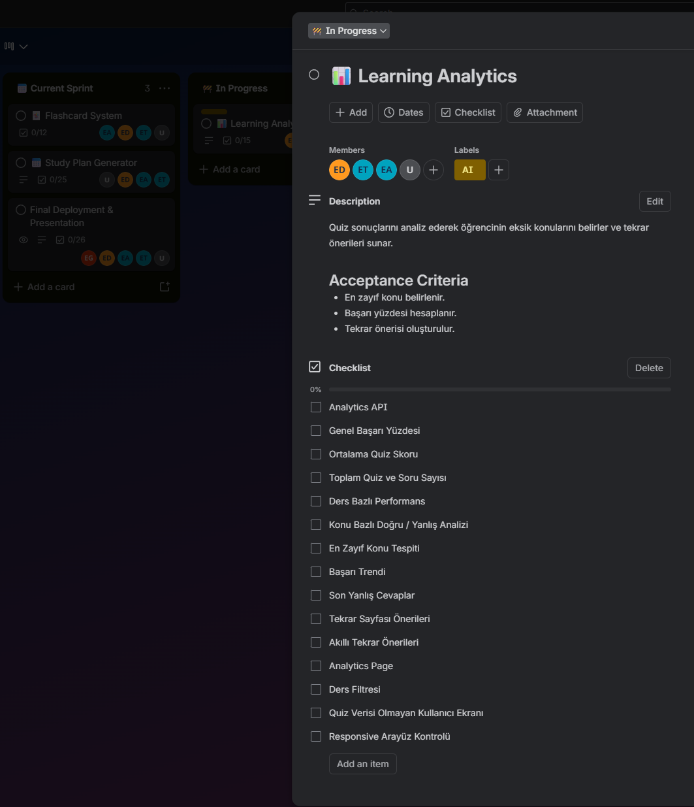
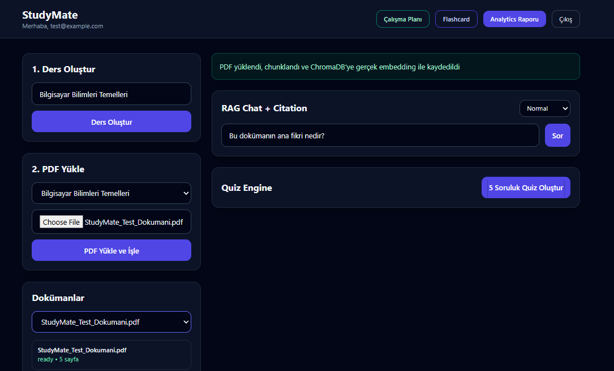
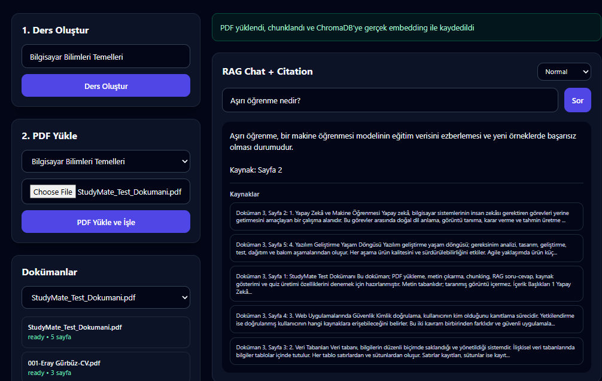
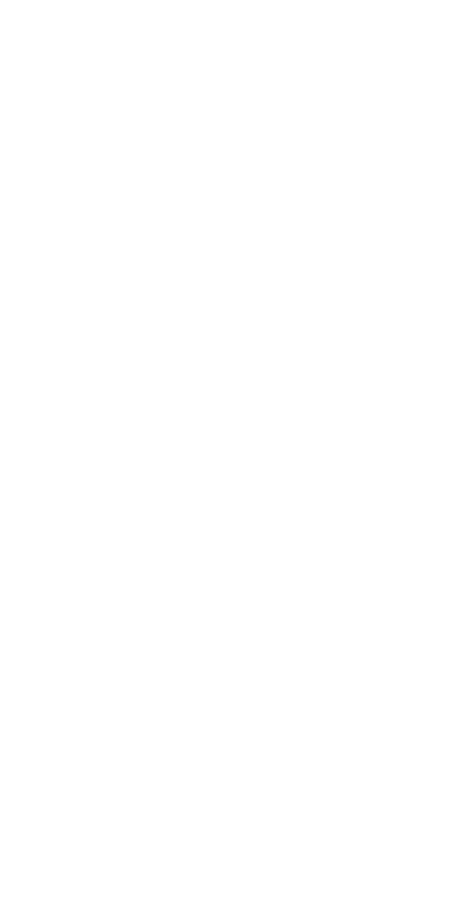
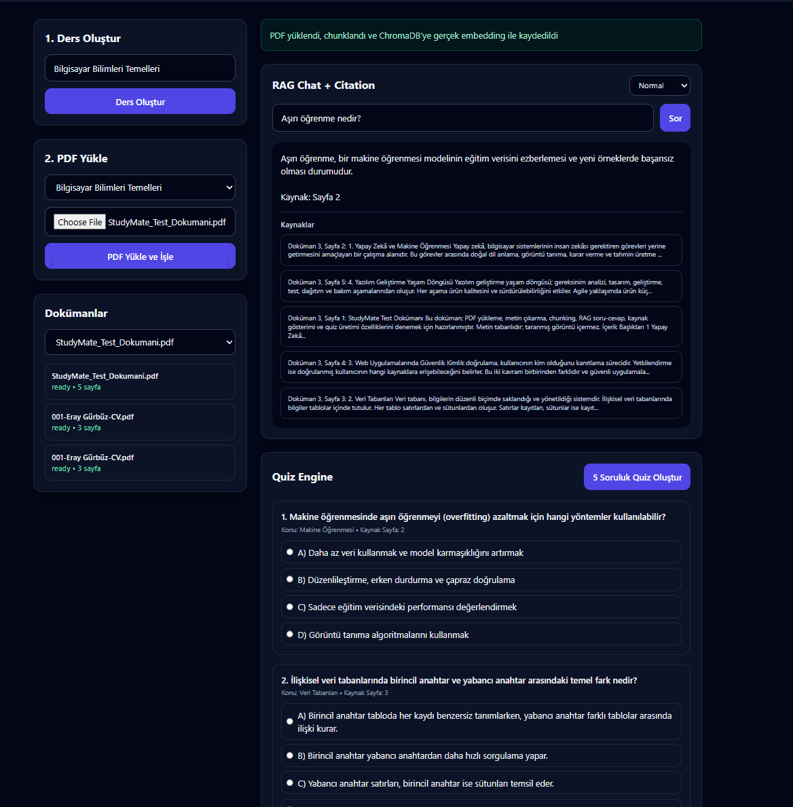

# StudyMate AI

## Takım İsmi

**Takım 113**

---

## Ürün İle İlgili Bilgiler

### Takım Elemanları

- **Eray Gürbüz:** Scrum Master
- **Esra Aydın :** Product Owner
- **Esra Meriç Topaktaş:** Developer
- **Eda Dilek:** Developer
- **Ege Onur Ünser:** Developer

---

## Ürün İsmi

**-- StudyMate AI --**

---

## Ürün Açıklaması

**StudyMate AI**, öğrencilerin kendi ders PDF'lerini yükleyerek bu dokümanlar üzerinden soru sorabildiği, kaynak sayfa referanslı cevaplar alabildiği ve yüklenen notlardan otomatik quiz oluşturabildiği yapay zekâ destekli bir öğrenme asistanıdır.

Projenin temel amacı, öğrencinin yalnızca belgeye soru sormasını sağlamak değil; aynı zamanda quiz sonuçlarına göre hangi konularda zorlandığını belirlemek ve kişiselleştirilmiş tekrar önerileri sunmaktır. Böylece StudyMate AI, klasik bir PDF chatbot'tan farklı olarak öğrencinin öğrenme sürecini takip eden ve eksik konularını görünür hale getiren bir çalışma arkadaşı olarak konumlanmaktadır.

---

## Ürün Özellikleri

Geliştirme süreci sonunda hedeflenen temel özellikler:

- Kullanıcı kayıt ve giriş sistemi
- Ders oluşturma ve ders bazlı doküman yönetimi
- PDF yükleme ve PDF içeriğini ayrıştırma
- PDF içeriğini chunk'lara bölme
- Gemini embedding ile belge içeriğini vektörleştirme
- ChromaDB ile semantik arama yapma
- Yüklenen PDF'e özel RAG tabanlı soru-cevap sistemi
- Cevaplarda kaynak sayfa gösterimi
- PDF içeriğinden otomatik quiz üretme
- Quiz çözme ve sonucu kaydetme
- Yanlış yapılan konulara göre zayıf konu analizi
- Eksik konulara göre tekrar önerisi oluşturma
- Basit RAG evaluation/test senaryoları

Sprint ilerledikçe bu liste tamamlanan özelliklere göre güncellenecektir.

---

## Hedef Kitle

- Lise öğrencileri
- Üniversite öğrencileri
- KPSS, ALES, YKS gibi sınavlara hazırlanan adaylar
- Kendi kendine çalışan bireyler
- Ders notlarını daha verimli kullanmak isteyen öğrenciler
- 15 - 30 yaş arası dijital öğrenme araçlarını kullanan kişiler

---

## Product Backlog URL

[StudyMate Trello Backlog Board](https://trello.com/invite/b/6a46ad8213bef21d683b442c/ATTI86989348b8784aece4373a6a16585f601D876828/-)

Backlog yapısı Trello üzerinde aşağıdaki ana Epic kartları üzerinden planlanmıştır:

- Authentication
- Course & Document Management
- PDF Processing
- RAG System
- Quiz Engine
- Learning Analytics
- Evaluation
- Deployment

Trello kolon yapısı:

- Product Backlog
- Sprint 1
- In Progress
- Review
- Testing
- Done
- Bugs

---

# SPRINT 1

Sprint içi puan değerlendirmesi **15** olarak belirlenmiştir.

**Puan tamamlama mantığı:** Proje boyunca tamamlanması gereken toplam backlog puanı **100** olarak belirlenmiştir. İlk sprint için bitirilmesi hedeflenen puan sayısı **15** olarak seçilmiştir. Sprint 1’de ürünün tamamen tamamlanması değil; projenin temel altyapısının kurulması, ilk arayüz ekranlarının hazırlanması ve sonraki sprintlerde geliştirilecek PDF işleme, RAG Chat, Quiz Engine ve Learning Analytics modülleri için başlangıç yapısının oluşturulması hedeflenmiştir.

**Daily Scrum:** Daily Scrum görüşmelerinin takım üyelerinin uygunluk durumuna göre **WhatsApp** üzerinden yapılmasına karar verilmiştir. Günlük ilerleme takibi Trello kartları üzerinden sağlanmış, ihtiyaç duyulan durumlarda kısa çevrim içi görüşmeler yapılmıştır.

**Toplantı ve Daily Scrum ScreenShotları:**

<details>
  <summary>Daily Scrum WhatsApp ekran görüntüsünü görüntülemek için tıklayın</summary>


</details>
Tasarım ve Developing Mantığı: Tasarım ve geliştirme sürecinin birlikte ilerlemesine karar verilmiştir. Sprint 1’de tasarım tarafında ürünün final ekranlarından ziyade temel kullanıcı akışını gösterecek ilk prototip ekranlara odaklanılmıştır. Geliştirme tarafında ise backend, frontend, AI/RAG ve quiz modüllerinin ilerleyen sprintlerde bağımsız geliştirilebilmesi için temel yapı oluşturulmuştur.

Sprint 1 board update: Sprint Board Screenshot:

Sprint 1 başlangıcında Trello üzerinde ürün backlog’u oluşturulmuş, ana epic kartları belirlenmiş ve Sprint 1 kapsamında üzerinde çalışılacak görevler Current Sprint listesine alınmıştır.

Backlog ve Current Sprint görünümü:


Sprint 1 görev akışı ve durum listeleri:


**Ürün Durumu:** Ekran Görüntüleri:

Giriş ekranı:


Dashboard / PDF yükleme ekranı:


**Sprint Review:**

Sprint 1 sonunda StudyMate projesinin temel iskeleti oluşturulmuştur. Kullanıcı giriş ekranı, dashboard yapısı, ders oluşturma alanı, PDF yükleme bölümü, doküman seçme alanı, RAG Chat + Citation bölümü ve Quiz Engine başlangıç alanı hazırlanmıştır.

Bu sprintte ürünün tüm özelliklerinin tamamlanması hedeflenmemiştir. Öncelik; proje yapısının kurulması, takım görev dağılımının netleşmesi ve sonraki sprintlerde geliştirilecek PDF işleme, RAG, quiz ve analiz modülleri için başlangıç zemininin hazırlanması olmuştur.

Alınan kararlar:

- Ürün adının **StudyMate** olarak kullanılmasına karar verilmiştir.
- İlk aşamada PDF tabanlı kişisel öğrenme asistanı akışına odaklanılmasına karar verilmiştir.
- Sprint 2’de PDF upload, text extraction, chunking ve embedding akışının geliştirilmesine karar verilmiştir.
- RAG Chat ve Quiz Engine alanlarının arayüzde yer almasına, gerçek veriyle çalışan hâllerinin sonraki sprintlerde tamamlanmasına karar verilmiştir.
- Quiz sonrası yanlış konu analizi ve kişisel tekrar önerisi projenin ayırt edici özellikleri olarak belirlenmiştir.

Sprint Review katılımcıları:

- Eray Gürbüz
- Esra Aydın
- Esra Meriç Topaktaş
- Eda Dilek
- Ege Onur Ünser

**Sprint Retrospective:**

- Takım içindeki görev dağılımının backend, frontend, AI/RAG ve quiz/analytics başlıklarına göre ilerlemesine karar verilmiştir.
- Trello kartlarında checklist ve acceptance criteria maddelerinin daha düzenli takip edilmesi gerektiği belirlenmiştir.
- Frontend görevlerinin ilgili epic kartlarının içinde daha açık şekilde belirtilmesine karar verilmiştir.
- Sprint 2’de PDF Processing ve RAG altyapısına daha fazla teknik ağırlık verilmesi kararlaştırılmıştır.

---

# SPRINT 2

Sprint içi puan değerlendirmesi **45** olarak belirlenmiştir.

Sprint içi puan değerlendirmesi **45** olarak belirlenmiştir.

**Backlog Dağıtma ve Puan Tamamlama Mantığı:** Proje boyunca tamamlanması planlanan toplam backlog puanı **100** olarak belirlenmiştir. Sprint 1’de temel proje yapısı, ilk arayüzler ve proje yönetimi çalışmaları için **15 puanlık** backlog tamamlanmıştır. Sprint 2 için ürünün temel teknik işlevlerini çalışır hâle getirecek **45 puanlık** backlog seçilmiştir.

Sprint 2 backlog’u oluşturulurken görevler teknik bağımlılık sırasına göre planlanmıştır. PDF işleme tamamlanmadan embedding ve retrieval; retrieval tamamlanmadan RAG Chat ve belgeye dayalı Quiz Engine çalışamayacağı için geliştirme sırası buna göre belirlenmiştir.

Bu sprintte Authentication, Course & Document Management, PDF Processing, Embedding, ChromaDB, Retrieval, RAG Chat, Citation, Quiz Engine, Docker, Alembic ve frontend–backend entegrasyonu görevlerine öncelik verilmiştir.

Görev dağılımında Authentication, Course ve Document backend yapısı Eray’a; Embedding, ChromaDB, Retrieval, RAG, Chat ve Evaluation Esra Aydın’a; frontend–backend entegrasyonu ve frontend altyapısı Esra Meriç Topaktaş’a; PDF Processing ve Quiz Engine Eda’ya; Docker, Alembic, entegrasyon, test ve sprint dokümantasyonu Ege’ye verilmiştir.

Analytics Dashboard, Flashcard Sistemi ve Study Plan Generator özellikleri mevcut RAG ve Quiz altyapısına bağımlı olduğu için Sprint 3 backlog’una aktarılmıştır. Sprint 3 için kalan **40 puanlık** backlog’un bu özellikler, final entegrasyon, test ve teslim çalışmalarına ayrılması planlanmıştır.

**Daily Scrum:** Sprint 2 döneminde Daily Scrum süreci Whatsapp ekran görüntüleri yerine kişi bazlı raporlama yöntemiyle yürütülmüştür. Her ekip üyesinin “Dün / önceki çalışma döneminde ne yaptım?”, “Bugün ne yapacağım?” ve “Önümde bir engel var mı?” sorularına verdiği yanıtlar tarih bazlı olarak kayıt altına alınmıştır.

**Toplantı ve Daily Scrum Dokümanı:**

<details>
  <summary>Sprint 2 kişi bazlı Daily Scrum dokümanını görüntülemek için tıklayın</summary>

[StudyMate AI Sprint 2 Daily Scrum Dokümanı](docs/sprint2/StudyMate_AI_Sprint_2_Daily_Scrum.docx)

</details>

**Tasarım ve Developing Mantığı:** Sprint 2’de Sprint 1’de hazırlanan arayüz iskeletleri gerçek backend servislerine bağlanmıştır. Bu sprintte yeni ekran üretmekten çok, mevcut ekranların gerçek authentication, course, document, RAG Chat ve quiz akışlarıyla çalışması hedeflenmiştir. Backend tarafında modüler servis yapısı, repository bağımlılıkları, migration sistemi ve Docker tabanlı çalışma ortamı oluşturulmuştur. AI tarafında embedding, vector store, retrieval, Gemini ve RAG katmanları birbirinden ayrılmıştır.

**Sprint 2 board update: Sprint Board Screenshotları:**

Sprint 2 başlangıcında PDF Processing, RAG System, Quiz Engine, Docker, Migration ve Frontend Integration görevleri Trello üzerinde ayrı kartlar hâlinde planlanmıştır. Sprint boyunca görevler In Progress, Review, Testing ve Done kolonları üzerinden takip edilmiştir.

Sprint 2 backlog ve görev dağılımı görünümü:



Sprint 2 güncel görev akışı:



**Ürün Durumu: Ekran Görüntüleri:**

PDF yükleme ve doküman işleme akışı:



RAG Chat ve kaynak gösterimi:



Quiz oluşturma ve sonuç akışı:



Dashboard:



**Sprint 2’de Tamamlanan Teknik Özellikler:**

- FastAPI backend proje yapısının tamamlanması
- PostgreSQL ve SQLAlchemy bağlantısının kurulması
- JWT tabanlı kayıt ve giriş sistemi
- Protected endpoint yapısı
- Course ve Document yönetimi
- PDF upload endpointi
- Dosya türü ve boyut doğrulaması
- PyMuPDF ile sayfa bazlı metin çıkarma
- Text cleaning ve chunking
- Chunk overlap yapısı
- Sayfa numarası ve doküman metadata bilgisinin korunması
- Embedding üretimi
- ChromaDB vector store entegrasyonu
- Doküman ve ders bazlı retrieval
- Gemini tabanlı RAG cevap üretimi
- Doküman ve sayfa bazlı citation gösterimi
- Chat history altyapısı
- PDF içeriğinden quiz üretimi
- Quiz çözme, skor hesaplama ve açıklamalı sonuç
- Retrieval evaluation scripti ve örnek test seti
- Docker Compose ile PostgreSQL, ChromaDB, backend ve frontend servislerinin birlikte çalıştırılması
- Alembic migration altyapısı
- Frontend API client, JWT, timeout ve hata yönetimi
- Login, dashboard ve gerçek API entegrasyonu

**Sprint 2 Takım Görev Dağılımı:**

- **Eray Gürbüz:** Scrum Master, issue ve blocker takibi, README güncellemesi, authentication, course ve document backend yapısı, kullanıcı yetkilendirme kontrolleri ve son merge kontrolü
- **Esra Aydın:** Embedding, ChromaDB, retrieval, Gemini entegrasyonu, RAG, chat, citation ve evaluation
- **Esra Meriç Topaktaş:** Frontend–backend entegrasyonu, API client, login/register bağlantısı, dashboard verileri, frontend build yapısı ve ürün ekran görüntüleri
- **Eda Dilek:** PDF processing, text extraction, text cleaning, chunking, Quiz Engine, quiz model/schema/service/route yapısı
- **Ege Onur Ünser:** Docker, Alembic, backend başlangıç altyapısı, requirements, clean-install, entegrasyon testi, smoke test ve Sprint 2 dokümantasyonu

**Sprint Review:**

Sprint 2 sonunda StudyMate AI, yalnızca arayüz iskeletlerinden oluşan bir prototip olmaktan çıkarak gerçek backend servisleriyle çalışan bir öğrenme platformuna dönüşmüştür. Kullanıcı artık sisteme kayıt olabilmekte, giriş yapabilmekte, ders oluşturabilmekte ve kendi PDF dokümanlarını yükleyebilmektedir.

Yüklenen PDF, PyMuPDF ile sayfa bazlı olarak ayrıştırılmakta, temizlenmekte ve chunk'lara bölünmektedir. Oluşturulan chunk'lar embedding sürecinden geçirilerek ChromaDB içerisine kaydedilmektedir. Kullanıcı doküman hakkında soru sorduğunda sistem ilgili chunk'ları retrieval ile bulmakta, yalnızca bu içerikleri Gemini modeline göndermekte ve kaynak doküman ile sayfa numarasını gösteren cevaplar üretmektedir.

Quiz Engine tarafında kullanıcı, işlenmiş PDF içeriğinden çoktan seçmeli sorular oluşturabilmekte, quizi çözebilmekte ve skor ile açıklamalı sonuçları görüntüleyebilmektedir.

Bu sprint sonunda çalışan temel ürün akışı:

```text
Kayıt / Giriş
↓
Ders Oluşturma
↓
PDF Yükleme
↓
Metin Çıkarma
↓
Text Cleaning
↓
Chunking
↓
Embedding
↓
ChromaDB
↓
RAG Chat
↓
Kaynak Gösterimi
↓
Quiz Oluşturma
↓
Quiz Çözme
↓
Skor ve Açıklamalı Sonuç
```

Sprint Review kapsamında ayrıca Docker ortamı, Alembic migration akışı, temiz kurulum senaryosu, authentication, PDF upload, retrieval, citation ve quiz akışı test edilmiştir.

Sprint Review katılımcıları:

- Eray Gürbüz
- Esra Aydın
- Esra Meriç Topaktaş
- Eda Dilek
- Ege Onur Ünser

**Sprint Retrospective:**

- Sprint 1’de hazırlanan arayüz iskeletlerinin gerçek backend servislerine bağlanması başarıyla tamamlanmıştır.
- Backend, AI/RAG, frontend, quiz ve altyapı görevlerinin ayrı sorumluluk alanlarında yürütülmesinin entegrasyon sürecini kolaylaştırdığı görülmüştür.
- Eray’ın Scrum Master olarak issue ve blocker takibini yürütmesine devam edilmesine karar verilmiştir.
- Ege’nin entegrasyon, test, kalite ve release koordinasyonuna odaklanmasının takım içi görev dağılımını dengelediği görülmüştür.
- PDF işleme, embedding ve retrieval akışlarında sayfa metadata bilgisinin korunmasının citation sistemi için kritik olduğu doğrulanmıştır.
- OCR desteğinin Sprint 2 kapsamına alınmamasına ve yalnızca metin katmanı bulunan PDF'lerin desteklenmesine karar verilmiştir.
- Analytics Dashboard, Flashcard Sistemi ve Study Plan Generator özelliklerinin geliştirilmesinin Sprint 3’e aktarılmasına karar verilmiştir.

---

# Notlar

Proje ilerledikçe her sprint sonunda aşağıdaki bölümler güncellenecektir:

- Sprint board screenshotları
- Daily Scrum kayıtları
- Ürün ekran görüntüleri
- Sprint Review çıktıları
- Sprint Retrospective kararları
- Tamamlanan özellik listesi
